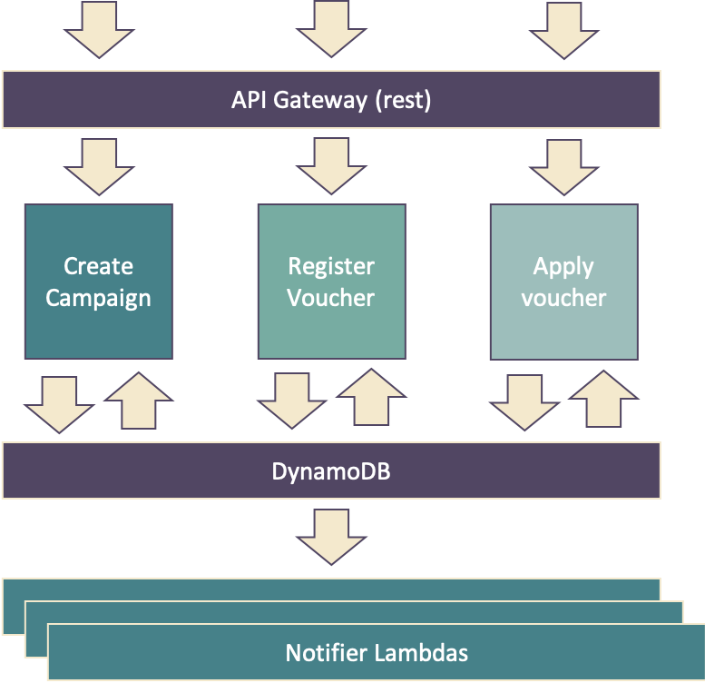

# Voucher Factory

## High level Design

 { height=50% }

## Design considerations

- We use AWS Lambdas in conjunction with DynamoDB for maximum horizontal scaleability.
Application should be able to handle more than 50000 requests per second without further adaptations.
- There is no additional costs when no campaigns are active as AWS Lambdas will scale to zero.
- Rest endpoints are handled with Amazon API Gateways

## Workflow
- An authenticated user will generate a named campaign.
- A specific voucher code will be generated in a campaign when assigned to a specific customer.
- The voucher code is sent to the customer by mail
- Redeeming the voucher will verify the validity and expiration time.

## Mail and Reporting
- Mail and reporting is made asynchronous by using DynamoDB flows. Mails are sent using Amazon SES from a lambda triggered directly when new vouchers are generated to the database.
- Reports can be generated with subcriteria (ie reports can be subscribed on a single campaign if needed); frequency of reports can be adjusted on a per subscriber basis.
- Mail and reports are asynchronous with retry and failure recovery logic configurable.

## Monitoring and traceability
- Alerting and metrics are kept in Amazon Cloudwatch
- Alerts can be set up if campaigns are at unexpected levels or to avoid excessive costs.

## Authentication
- IAM is used for general access management, we are leveraging oidc for staff interactions interfacing with existing PAM system.

## Database operations
- We are using non-locking atomic operations throughout the system to ensure highly scaleable operations; retry logic is in place in the few places where this may have a potential to create failures. At 1000 requests per seconds retrylogic should be required in less than one call in 4 million.
